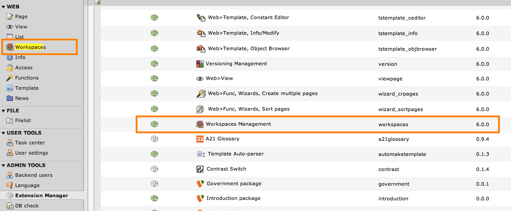

.. ==================================================
.. FOR YOUR INFORMATION 
.. --------------------------------------------------
.. -*- coding: utf-8 -*- with BOM.  Check: ÄÖÜäöüß

.. include:: ../Includes.txt

=========================
Installation
=========================

Grundsätzlich sind die workspaces automatisch mit dem Core installiert. Sollte die Extension "workspaces" aus irgendeinem Grund fehlen, kann diese über den Extension Manager installiert werden.

Sobald die workspaces installiert sind, ist links innerhalb der Modulen auch der Punkt "workspaces" zu sehen. Nach der Installation von TYPO3 existiert im Backend bereits ein Workspace: der “LIVE-Workspace”.
